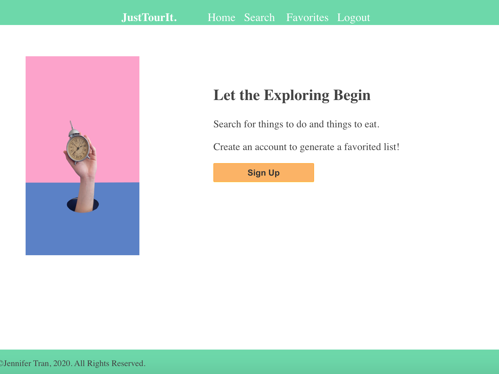
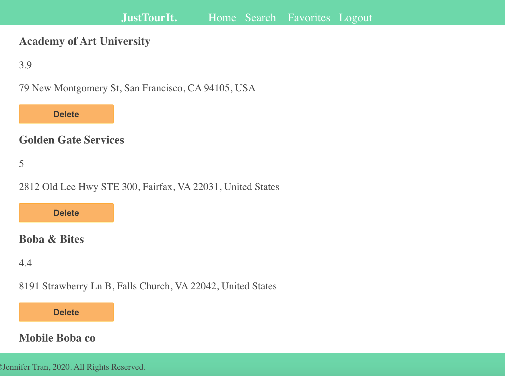
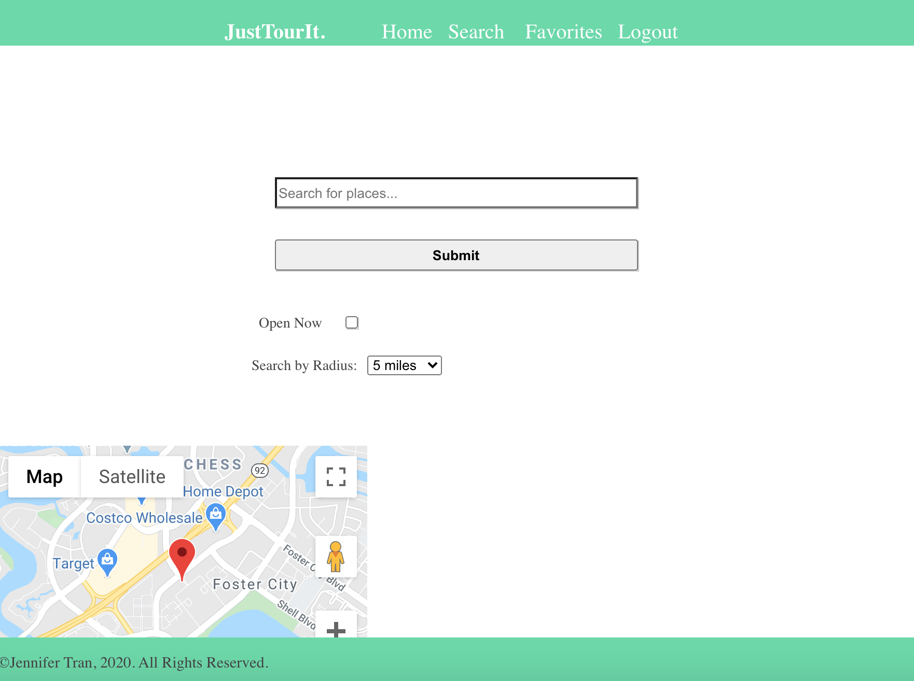

LetsTourIt Server
================
* * *

Summary
-------

This is an application where users can search up places near their current location. The user can favorite a place so that they can refer to the favorited list later. 

Demo
----
* * *

[Demo](https://letstourit.jennantran.vercel.app)  
[Repo](https://github.com/jennantran/letstourit-app) 
[Client Repo](https://github.com/jennantran/letstourit-app) 

Demo user account:  
username: jennantran  
password: password
* * *

Getting Started
---------------
1. Clone the server repository to your local machine: git clone https://github.com/jennantran/letstourit-server.git
2. Cd into the new cloned repository
3. Install the node dependencies using npm install
4. Update the .env file with PORT, DATABASE_URL, TEST_DATABASE_URL, JWT_SECRET, and API_TOKEN
5. Run migration using: npm run migrate
6. Run the sql scripts and seed files on Postgres database

Scripts
-----------
To start the application: npm run dev
To run migrations: npm run migrate
Run the tests: npm run test

API Documentation
-------
GET /api/favorites
DELETE /api/favorites/:place_id
POST /api/favorites/:place_id

GET api/users
POST api/users

Screenshots
-----------
Homepage:

Favorites Page:

Search Page:

Results: 

* * *

Technologies Used
-----------------
1. Chai, Mocha
2. JWT
3. Node
4. Express
